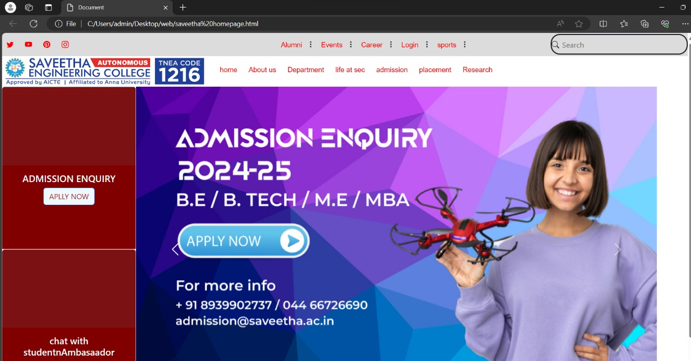

# EX01 Developing a Simple Webserver
## Date:

## AIM:
To develop a simple webserver to serve html pages.

## DESIGN STEPS:
### Step 1: 
HTML content creation.

### Step 2:
Design of webserver workflow.

### Step 3:
Implementation using Python code.

### Step 4:
Serving the HTML pages.

### Step 5:
Testing the webserver.

## PROGRAM:
```
<!DOCTYPE html>
<html lang="en">

<head>
    <meta charset="UTF-8">
    <meta name="viewport" content="width=device-width, initial-scale=1.0">
    <title>Document</title>
    <link href="https://cdn.jsdelivr.net/npm/bootstrap@5.3.3/dist/css/bootstrap.min.css" rel="stylesheet"
        integrity="sha384-QWTKZyjpPEjISv5WaRU9OFeRpok6YctnYmDr5pNlyT2bRjXh0JMhjY6hW+ALEwIH" crossorigin="anonymous">
    <link rel="stylesheet" href="https://cdn.jsdelivr.net/npm/bootstrap-icons@1.11.3/font/bootstrap-icons.min.css">
    <style>
        a {
            color: red;
            text-decoration: none;
            padding: 10px;
            font-family: Arial, Helvetica, sans-serif;
            font-size: 15px;
            border-radius: 20px;
        }

        a:hover {
            color: grey;
            background-color: rgb(141, 165, 204);
        }

        .row1 {
            background-color: gainsboro;
            display: flex;
            height: 50px;
            place-items: center;
        }

        i:hover {
            color: white;
        }
        .searchtext{
            outline: none;
        }
    </style>
</head>

<body>

    <div class="row1">
        <div style="width: 40%;">
            <a href=""><i class="bi bi-twitter"></i></a>
            <a href=""><i class="bi bi-youtube"></i></a>
            <a href=""><i class="bi bi-pinterest"></i></a>
            <a href=""><i class="bi bi-instagram"></i></a>


        </div>

        <div style="width: 40%;">
        <a href="">Alumni</a><i class="bi bi-three-dots-vertical"></i>
        <a href="">Events</a><i class="bi bi-three-dots-vertical"></i>
        <a href="">Career</a><i class="bi bi-three-dots-vertical"></i>
        <a href="">Login</a><i class="bi bi-three-dots-vertical"></i>
        <a href="">sports</a><i class="bi bi-three-dots-vertical"></i>


    </div>

    <div style="width: 20%;">
        <div style="border: 3px solid;border-radius: 20px; ">
            <i class="bi bi-search"></i>
            <input type="text" style="height: 40px;background-color: gainsboro ; border: 0px" placeholder="Search"  class="searchtext"/>
        </div>
    </div>
    </div>
    <div>
        <!--row 1-->
        <div style="display:flex">
            <!--row 1-->
            <div style="width:30%">
                
            </div>
            <!--row 1- column 2-->
            <div style="width:70% text-align:center;" class="p-3 border-3 border-secondary" >


                <a href="">home</a>
                <a href="">About us</a>
                <a href="">Department</a>
                <a href="">life at sec</a>
                <a href="">admission</a>
                <a href="">placement</a>
                <a href="">Research</a>
            </div>
        </div>
    </div>

    <div style="display:flex;">
        <div>
            <div>
                <div class="card" style="width: 18rem; height:350px">
                    
                    <div class="card-body" Style="background-color:maroon ; color: white;text-align: center;">
                        <h5 class="card-title">ADMISSION ENQUIRY</h5>

                        <a href="https://www.saveetha.ac.in/" class="btn btn-primary"
                            style="background-color: aliceblue; color:brown">APLLY NOW</a>
                    </div>
                </div>
            </div>
            <div>
                <div class="card" style="width: 18rem;height: 350px;">
                    
                    <div class="card-body" Style="background-color:maroon ; color: white;text-align: center;">
                        <h5 class="card-title">chat with studentnAmbasaador</h5>

                        <a href="https://www.saveetha.ac.in/" class="btn btn-primary"
                            style="background-color: aliceblue; color:brown">KNOW MORE</a>
                    </div>
                </div>
            </div>
        </div>


        <div id="carouselExampleIndicators" class="carousel slide">
            <div class="carousel-indicators">
                <button type="button" data-bs-target="#carouselExampleIndicators" data-bs-slide-to="0" class="active"
                    aria-current="true" aria-label="Slide 1"></button>
                <button type="button" data-bs-target="#carouselExampleIndicators" data-bs-slide-to="1"
                    aria-label="Slide 2"></button>
                <button type="button" data-bs-target="#carouselExampleIndicators" data-bs-slide-to="2"
                    aria-label="Slide 3"></button>
            </div>
            <div class="carousel-inner">
                <div class="carousel-item active">
                    
                </div>
                <div class="carousel-item">
                    
                </div>
                <div class="carousel-item">
                    
                </div>
            </div>
            <button class="carousel-control-prev" type="button" data-bs-target="#carouselExampleIndicators"
                data-bs-slide="prev">
                <span class="carousel-control-prev-icon" aria-hidden="true"></span>
                <span class="visually-hidden">Previous</span>
            </button>
            <button class="carousel-control-next" type="button" data-bs-target="#carouselExampleIndicators"
                data-bs-slide="next">
                <span class="carousel-control-next-icon" aria-hidden="true"></span>
                <span class="visually-hidden">Next</span>
            </button>
        </div>


    </div>
    </div>

    <script src="https://cdn.jsdelivr.net/npm/bootstrap@5.3.3/dist/js/bootstrap.bundle.min.js"
        integrity="sha384-YvpcrYf0tY3lHB60NNkmXc5s9fDVZLESaAA55NDzOxhy9GkcIdslK1eN7N6jIeHz"
        crossorigin="anonymous"></script>
</body>

</html>
```
## OUTPUT:

  
## RESULT:
The Program for implementing simple webserver is executed successfully.